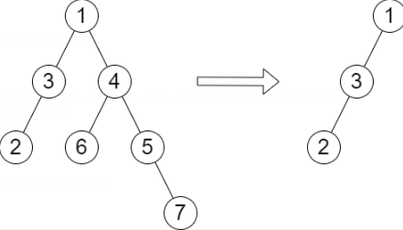

## 题目描述
[leetcode 困难题](https://leetcode.cn/problems/height-of-binary-tree-after-subtree-removal-queries/submissions/)

给你一棵 二叉树 的根节点 root ，树中有 n 个节点。每个节点都可以被分配一个从 1 到 n 且互不相同的值。另给你一个长度为 m 的数组 queries 。

你必须在树上执行 m 个 独立 的查询，其中第 i 个查询你需要执行以下操作：

从树中 移除 以 queries[i] 的值作为根节点的子树。题目所用测试用例保证 queries[i] 不 等于根节点的值。
返回一个长度为 m 的数组 answer ，其中 answer[i] 是执行第 i 个查询后树的高度。

注意：

- 查询之间是独立的，所以在每个查询执行后，树会回到其 初始 状态。
- 树的高度是从根到树中某个节点的 最长简单路径中的边数 。
 

示例1：


```
输入：root = [1,3,4,2,null,6,5,null,null,null,null,null,7], queries = [4]
输出：[2]
解释：上图展示了从树中移除以 4 为根节点的子树。
树的高度是 2（路径为 1 -> 3 -> 2）。
```

提示1：
```
树中节点的数目是 n
2 <= n <= 10^5
1 <= Node.val <= n
树中的所有值 互不相同
m == queries.length
1 <= m <= min(n, 10^4)
1 <= queries[i] <= n
queries[i] != root.val
```

## dfs
设当前节点为 $p$ ，以 $p.left$ 为例，询问结果为 

$max(depth(p) + height(right), depth(p.father) + height(p.father.otherChild))$ 

其中 $depth(x)$ 为某个节点 $x$ 的深度， $height(x)$ 为以 $x$ 节点作为根节点的子树高度。表达式前者表示经过 $p$ 以及 $p.right$ 时的最大路径长度，后者为不经过 $p$ 时的最大路径长度，显然答案为两者的最大值。


具体可以通过两次 $dfs$ 来实现， 其中第一次 $dfs$ 预处理出 $height$ 和 $depth$ ， 第二次 $dfs$ 处理出对于每个节点的询问答案。

时间复杂度 $O(n)$ ，$n$ 为节点个数。
```Java
import java.util.Optional;

class Solution {
    private final Map<Integer, Integer> height = new HashMap<>();
    private final Map<Integer, Integer> depth = new HashMap<>();
    private final Map<Integer, Integer> ans = new HashMap<>();

    public int[] treeQueries(TreeNode root, int[] queries) {
        dfs(root, 0);
        dfsAns(root, 0);
        return Arrays.stream(queries).map(ans::get).toArray();
    }

    private int dfs(TreeNode p, int depthVal){
        if(p == null){
            return 0;
        }
        int heightVal = Math.max(dfs(p.left, depthVal + 1), dfs(p.right, depthVal + 1)) + 1;
        height.put(p.val, heightVal - 1);
        depth.put(p.val, depthVal);
        return heightVal;
    }

    private void dfsAns(TreeNode p, int result){
        if(p == null){
            return;
        }
        ans.put(p.val, result);
        
        dfsAns(p.left, Math.max(depth.get(p.val) + 
        height.getOrDefault(Optional.ofNullable(p.right).orElseGet(TreeNode::new).val, -1) + 1, result));

        dfsAns(p.right, Math.max(depth.get(p.val) + 
        height.getOrDefault(Optional.ofNullable(p.left).orElseGet(TreeNode::new).val, -1) + 1, result));
    }

}
```