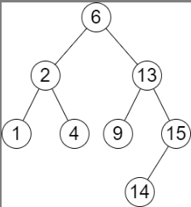

## 题目描述
[leetcode 中等题](https://leetcode.cn/problems/closest-nodes-queries-in-a-binary-search-tree/)

给你一个 二叉搜索树 的根节点 root ，和一个由正整数组成、长度为 n 的数组 queries 。

请你找出一个长度为 n 的 二维 答案数组 answer ，其中 answer[i] = [mini, maxi] ：

mini 是树中小于等于 queries[i] 的 最大值 。如果不存在这样的值，则使用 -1 代替。
maxi 是树中大于等于 queries[i] 的 最小值 。如果不存在这样的值，则使用 -1 代替。
返回数组 answer 。


示例1：


```
输入：root = [6,2,13,1,4,9,15,null,null,null,null,null,null,14], queries = [2,5,16]
输出：[[2,2],[4,6],[15,-1]]
解释：按下面的描述找出并返回查询的答案：
- 树中小于等于 2 的最大值是 2 ，且大于等于 2 的最小值也是 2 。所以第一个查询的答案是 [2,2] 。
- 树中小于等于 5 的最大值是 4 ，且大于等于 5 的最小值是 6 。所以第二个查询的答案是 [4,6] 。
- 树中小于等于 16 的最大值是 15 ，且大于等于 16 的最小值不存在。所以第三个查询的答案是 [15,-1] 。
```

提示1：
```
树中节点的数目在范围 [2, 105] 内
1 <= Node.val <= 106
n == queries.length
1 <= n <= 105
1 <= queries[i] <= 106
```

## 二分查找
需要注意的是题目给的是二叉查找树而不是平衡树，如果直接在树上查找的话，某些数据下树可能会退化成链表导致 TLE。

中序遍历树得到排序后的数组，再二分查找出 $min_x$ 以及 $max_x$ 即可。

可以通过两次左闭右开的二分查找分别通过缩小右边界、左边界获得 $min_x$ 和 $max_x$ 。
```Java
class Solution {
    public List<List<Integer>> closestNodes(TreeNode root, List<Integer> queries) {
        List<Integer> sort = dfs(root, new ArrayList<>());
        int n = sort.size();
        List<List<Integer>> ans = new ArrayList<>();
        for(int i = 0; i < queries.size(); i++){
            List<Integer> cur = new ArrayList<>();
            int left = 0, right = n, target = queries.get(i);
            while(left < right){
                int mid = left + (right - left >> 1);
                if(sort.get(mid) < target){
                    left = mid + 1;
                }else if(sort.get(mid) >= target){
                    right = mid;
                }
            }
            if(left < n && sort.get(left) == target){
                cur.add(sort.get(left));
            }else if(left - 1 >= 0){
                cur.add(sort.get(left - 1));
            }else{
                cur.add(-1);
            }
            left = 0;
            right = n;
            while(left < right){
                int mid = left + (right - left >> 1);
                if(sort.get(mid) <= target){
                    left = mid + 1;
                }else if(sort.get(mid) > target){
                    right = mid;
                }
            }
            if(left - 1 >= 0 && sort.get(left - 1) == target){
                cur.add(sort.get(left - 1));
            }else if(left < n){
                cur.add(sort.get(left));
            }else{
                cur.add(-1);
            }
            ans.add(cur);
        }
        return ans;
    }
    
    private List<Integer> dfs(TreeNode root, List<Integer> sort){
        if(root == null){
            return sort;
        }
        dfs(root.left, sort);
        sort.add(root.val);
        dfs(root.right, sort);
        return sort;
    }
}
```

当然也可以通过缩小右边界一次性得到 $min_x$ 和 $max_x$。
```Java
class Solution {
    public List<List<Integer>> closestNodes(TreeNode root, List<Integer> queries) {
        List<Integer> sort = dfs(root, new ArrayList());
        int n = sort.size();
        List<List<Integer>> ans = new ArrayList<>();
        for(int i = 0; i < queries.size(); i++){
            List<Integer> cur = new ArrayList<>();
            int left = 0, right = n, target = queries.get(i);
            while(left < right){
                int mid = left + (right - left >> 1);
                if(sort.get(mid) < target){
                    left = mid + 1;
                }else{
                    right = mid;
                }
            }
            if(left < n && sort.get(left) == target){
                cur.add(sort.get(left));
            }else if(left - 1 >= 0){
                cur.add(sort.get(left - 1));
            }else{
                cur.add(-1);
            }                       
            int b = (left < n ? sort.get(left) : -1);      
            cur.add(b);
            ans.add(cur);
        }
        return ans;
    }
    
    private List<Integer> dfs(TreeNode root, List<Integer> sort){
        if(root == null){
            return sort;
        }
        dfs(root.left, sort);
        sort.add(root.val);
        dfs(root.right, sort);
        return sort;
    }
}
```
缩小左边界一次性得到 $min_x$ 和 $max_x$。
```Java
// 二分查找通过缩小左边界一次性得到 min_x 和 min_y
class Solution {
    public List<List<Integer>> closestNodes(TreeNode root, List<Integer> queries) {
        List<Integer> sort = dfs(root, new ArrayList());
        int n = sort.size();
        List<List<Integer>> ans = new ArrayList<>();
        for(int i = 0; i < queries.size(); i++){
            List<Integer> cur = new ArrayList<>();
            int left = 0, right = n, target = queries.get(i);
            while(left < right){
                int mid = left + (right - left >> 1);
                if(sort.get(mid) > target){
                    right = mid;
                }else{
                    left = mid + 1;
                }
            }
            int a = (left - 1 >= 0 ? sort.get(left - 1) : -1);
            cur.add(a);
            if(left - 1 >= 0 && sort.get(left - 1) == target){
                cur.add(sort.get(left - 1));
            }else if(left < n){
                cur.add(sort.get(left));
            }else{
                cur.add(-1);
            }
            ans.add(cur);
        }
        return ans;
    }
    
    private List<Integer> dfs(TreeNode root, List<Integer> sort){
        if(root == null){
            return sort;
        }
        dfs(root.left, sort);
        sort.add(root.val);
        dfs(root.right, sort);
        return sort;
    }

}
```