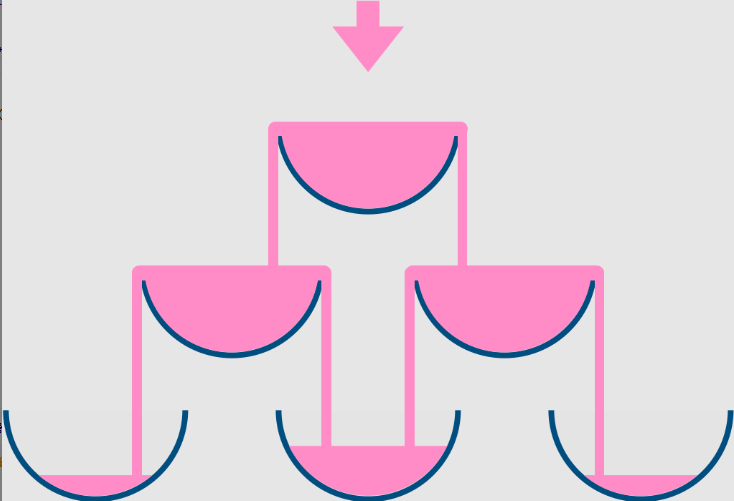

## 题目描述
[leetcode 中等题](https://leetcode.cn/problems/champagne-tower/)

我们把玻璃杯摆成金字塔的形状，其中 第一层 有 1 个玻璃杯， 第二层 有 2 个，依次类推到第 100 层，每个玻璃杯 (250ml) 将盛有香槟。

从顶层的第一个玻璃杯开始倾倒一些香槟，当顶层的杯子满了，任何溢出的香槟都会立刻等流量的流向左右两侧的玻璃杯。当左右两边的杯子也满了，就会等流量的流向它们左右两边的杯子，依次类推。（当最底层的玻璃杯满了，香槟会流到地板上）

例如，在倾倒一杯香槟后，最顶层的玻璃杯满了。倾倒了两杯香槟后，第二层的两个玻璃杯各自盛放一半的香槟。在倒三杯香槟后，第二层的香槟满了 - 此时总共有三个满的玻璃杯。在倒第四杯后，第三层中间的玻璃杯盛放了一半的香槟，他两边的玻璃杯各自盛放了四分之一的香槟，如下图所示。



现在当倾倒了非负整数杯香槟后，返回第 i 行 j 个玻璃杯所盛放的香槟占玻璃杯容积的比例（ i 和 j 都从0开始）。


示例1：
```
示例 1:
输入: poured(倾倒香槟总杯数) = 1, query_glass(杯子的位置数) = 1, query_row(行数) = 1
输出: 0.00000
解释: 我们在顶层（下标是（0，0））倒了一杯香槟后，没有溢出，因此所有在顶层以下的玻璃杯都是空的。
```

示例 2:
```
输入: poured(倾倒香槟总杯数) = 2, query_glass(杯子的位置数) = 1, query_row(行数) = 1
输出: 0.50000
解释: 我们在顶层（下标是（0，0）倒了两杯香槟后，有一杯量的香槟将从顶层溢出，位于（1，0）的玻璃杯和（1，1）的玻璃杯平分了这一杯香槟，所以每个玻璃杯有一半的香槟。
```

示例3:
```
输入: poured = 100000009, query_row = 33, query_glass = 17
输出: 1.00000
```

提示1：
```
0 <= poured <= 109
0 <= query_glass <= query_row < 100
```

## 动态规划
首先需要知道除了最上层的杯子，其余所有杯子 $[i, j]$ 的香槟均来自上一层的杯子 $[i - 1, j]$ 和 $[i - 1, j + 1]$，并且当该杯子满后（超过$1$），流出的水会等量的流向下一层 $[i + 1, j]$ 和 $[i + 1, j + 1]$。

dp，定义 $f(i, j)$ 表示流过该层的香槟总量，那么 $f(0, 0)$ 为 $poured$，可以得到

$$
\begin{align}
&f(i + 1, j) += \frac{f(i, j) - 1}{2}\\\\
&f(i + 1, j + 1) += \frac{f(i, j) - 1}{2}\\\\
\end{align}
$$

$min(1, f(query_row, query_glass))$ 为答案。

```Java
class Solution {
    public double champagneTower(int poured, int query_row, int query_glass) {
        double[][] dp = new double[query_row + 1][query_row + 1];
        dp[0][0] = poured;
        for(int i = 0; i < query_row; i++){
            for(int j = 0; j <= i; j++){
                if(dp[i][j] <= 1){
                    continue;
                }
                dp[i + 1][j] += (dp[i][j] - 1) / 2;
                dp[i + 1][j + 1] += (dp[i][j] - 1) / 2;
            }
        }
        return Math.min(dp[query_row][query_glass], 1);
    }
}
```

可以发现，每层的香槟流量，只依赖于上一层，所以可以用滚动数组的方式进行优化。
```Java
class Solution {
    public double champagneTower(int poured, int query_row, int query_glass) {
        double[] dp = new double[query_row + 1];
        dp[0] = poured;
        for(int i = 0; i < query_row; i++){
            double[] temp = new double[query_row + 1];
            for(int j = 0; j <= i; j++){
                if(dp[j] <= 1){
                    continue;
                }
                temp[j] += (dp[j] - 1) / 2;
                temp[j + 1] += (dp[j] - 1) / 2;
            }
            dp = temp;
        }
        return Math.min(dp[query_glass], 1);
    }
}
```